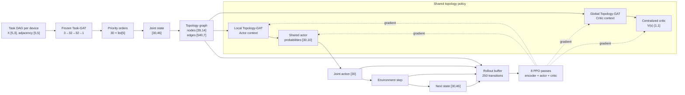
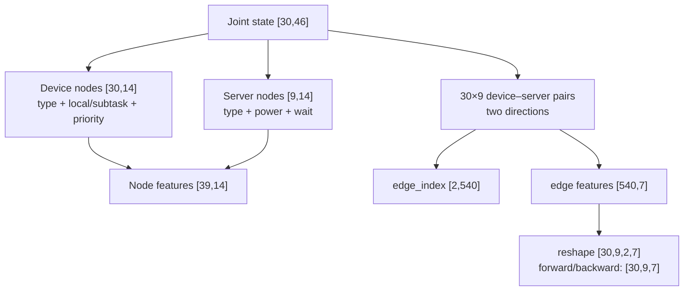
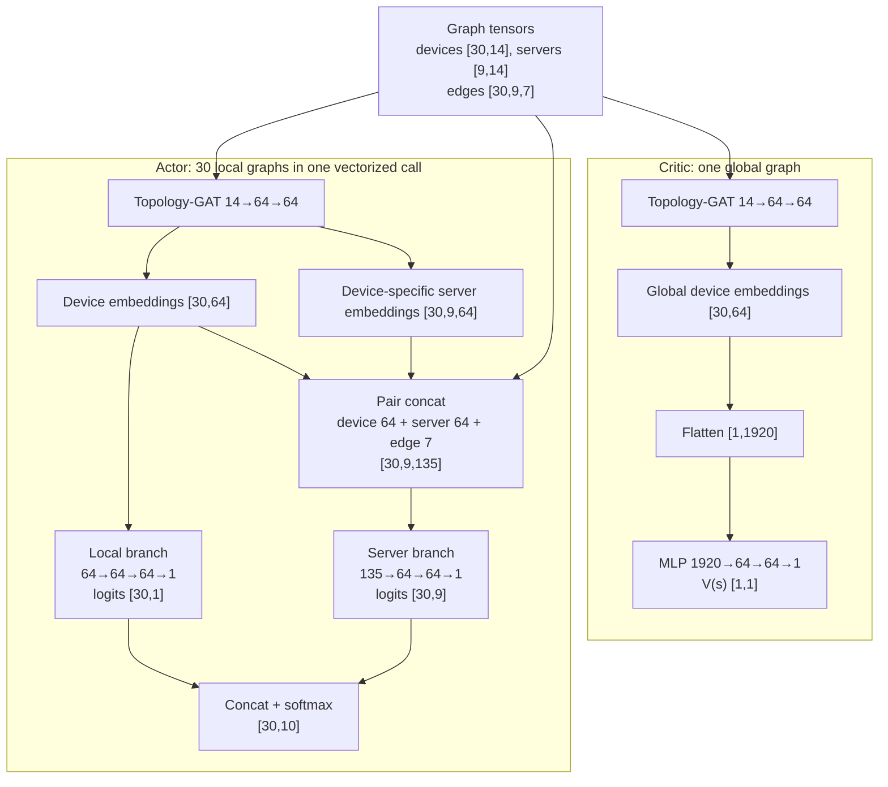
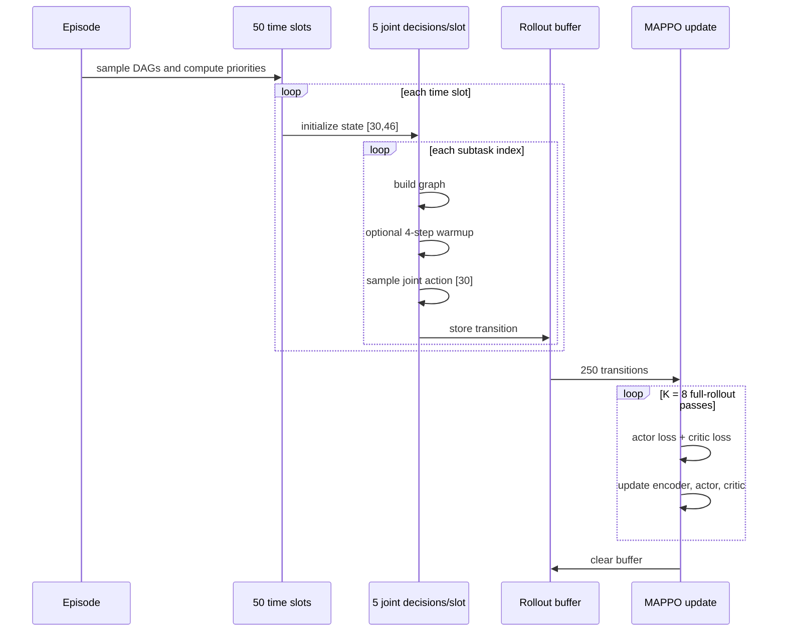

# Dual-GAT MAPPO Architecture

This document describes the **current implementation**, using the large topology
as the running example. It is the primary architecture reference and should be
updated whenever the model or training procedure changes.

## 1. Configuration and end-to-end flow

| Symbol | Meaning | Value |
|---|---|---:|
| `D` | device agents | 30 |
| `S` | edge servers | 9 |
| `M` | subtasks per DAG | 5 |
| `A=S+1` | actions per device: local + servers | 10 |
| `T` | time slots per episode | 50 |
| `L=T×M` | joint transitions per episode | 250 |
| `H`, `Z` | topology-GAT hidden/embedding widths | 64, 64 |
| `K` | PPO passes over one rollout | 8 |



The two GATs have separate roles:

- **Task-GAT** scores the subtasks used to form a priority order. It is
  pretrained, frozen, and called again for newly sampled DAGs in every time
  slot; the environment subsequently validates DAG dependencies.
- **Topology-GAT** represents device–server connectivity. Its weights are shared
  by the actor and critic paths and are jointly optimized by MAPPO.

## 2. Task priority and environment state

For each device, Task-GAT receives five subtask nodes:

```text
Task node features [5,3]
  columns = [hierarchy level, out-degree, cumulative successor CPU / 1e6]

Adjacency [5,5]
  current DAG: 1→2, 1→3, 2→4, 3→4, 4→5

[5,3] → GAT(3→32) → [5,32]
      → GAT(32→32) → [5,32]
      → Linear(32→1) → scores [5,1]
      → descending argsort → priority list[5]
```

The environment then builds one 46-dimensional state per device:

| Slice | Shape | Content |
|---|---:|---|
| `0:5` | `[5]` | local power/wait and current subtask CPU/input/result size |
| `5:10` | `[5]` | normalized priority ranks for the complete DAG |
| `10:19` | `[9]` | server compute powers |
| `19:28` | `[9]` | server waiting times |
| `28:37` | `[9]` | connection-window starts |
| `37:46` | `[9]` | connection-window ends |

Thus the joint state is `[D,46] = [30,46]`. One joint action completes the
current subtask for all 30 devices, increments their subtask indices, and returns
a new `[30,46]` state. A slot therefore contains five state transitions, not one:

```text
S₁ᵗ → A₁ᵗ → S₂ᵗ → ... → A₅ᵗ → S₆ᵗ
```

## 3. State-to-graph transformation



Each directed edge has seven features:

```text
[direction_1, direction_2, connected, disconnected,
 window_start, window_end, window_length]
```

The graph contains all 270 device–server pairs, including disconnected pairs.
The large experiments use `use_action_mask=False`, so disconnected server
actions remain in the policy distribution and are handled by the environment.

Each Topology-GAT layer applies:

```text
node projection:      F_in → F_out
edge projection:      7 → F_out
attention projection: 3F_out → 1

attention(u→v) = LeakyReLU(Wa [Wn xu || Wn xv || We euv])
message(u→v)   = Wn xu + We euv
output(v)      = Σu softmax(attention(u→v)) × message(u→v)
```

The encoder has two layers: `14→64`, ELU, then `64→64`.

## 4. Actor and critic tensor paths



The actor sees one local graph per device: that device, all nine servers, and
their edges. The critic sees one global graph in which every server aggregates
messages from all 30 devices. Both paths reuse the same Topology-GAT parameters.

Action collection produces:

```text
probabilities [30,10]
  → 30 Categorical distributions
  → joint actions [30] + old log-probabilities [30]
```

The deployment policy requires only the topology encoder and actor: **27,586
parameters**. The centralized critic is training-only.

## 5. Warmup, rollout, and MAPPO update

During the first 20 episodes, four auxiliary updates are performed before each
joint action. Warmup and MAPPO therefore coexist; MAPPO is active from episode 1.

```text
Local embeddings:
  device [30,64], server [30,9,64]
  → pair embeddings [30,9,128]
  → MLP 128→64→64
  → feasibility logits [30,9]
  → window estimates [30,9]

L_aux = BCE(feasibility) + 0.5 × MSE(window length)
```

Warmup updates `Topology-GAT + warmup head`; it does not update the actor or
critic. After episode 20, only the auxiliary updates stop.



After a complete episode, stacked rollout shapes are:

| Tensor | Shape |
|---|---:|
| actions, rewards, old log-probabilities | `[250,30]` |
| dones, team rewards, values, TD targets, advantages | `[250,1]` |
| device node batch | `[250,30,14]` |
| server node batch | `[250,9,14]` |
| forward/backward edge batches | `[250,30,9,7]` |
| actor probabilities | `[250,30,10]` |
| global critic embeddings | `[250,30,64]` |

The current implementation uses a normalized **one-step TD advantage**, not
full returns or GAE:

```text
team_reward_l = mean_i reward_l,i                         [250,1]
target_l = team_reward_l + γ V(next_l)(1-done_l)          [250,1]
advantage_l = normalize(target_l - V(current_l))          [250,1]

ratio = exp(new_log_prob - old_log_prob)                  [250,30]
actor loss = PPO clipped objective - entropy bonus
critic loss = MSE(V(current), target)
```

Each of the eight PPO epochs processes the full 250-transition rollout; the
current code does not split it into minibatches.

## 6. Parameter and gradient ownership

| Module | Parameters | Updated by |
|---|---:|---|
| frozen Task-GAT | 1,281 | separate pretraining only |
| Topology-GAT encoder | 6,272 | auxiliary warmup and MAPPO |
| shared actor | 21,314 | MAPPO actor loss |
| centralized critic | 127,169 | MAPPO critic loss |
| warmup head | 12,546 | auxiliary warmup only |

```text
MAPPO-optimized parameters       = 154,755
Warmup variant active parameters = 167,301
Deployment parameters            = 27,586  (encoder + actor)
```

During PPO, actor-loss gradients reach the shared encoder through the local
path, while critic-loss gradients reach it through the global path. The two
gradients are combined in the same backward pass.

## 7. Implementation caveats

1. **Priority order:** descending score sorting is not a constrained
   topological sort. The environment rejects an order that violates a DAG edge.
2. **Warmup behavior policy:** during the first 20 episodes, auxiliary steps
   modify the encoder while the rollout is being collected; the behavior policy
   is therefore not fixed throughout those episodes.
3. **Slot boundary:** the stored next graph after subtask 5 is generated before
   the next slot's new DAG is initialized, so it is not the actual graph used by
   the following decision.
4. **PPO variant:** the code uses one-step TD targets, no GAE, no full returns,
   and no minibatches.
5. **Warmup sampling:** auxiliary warmup uses all current device–server pairs;
   there is no `same_class=True` sampling step in the current implementation.
