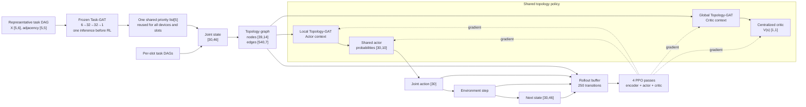
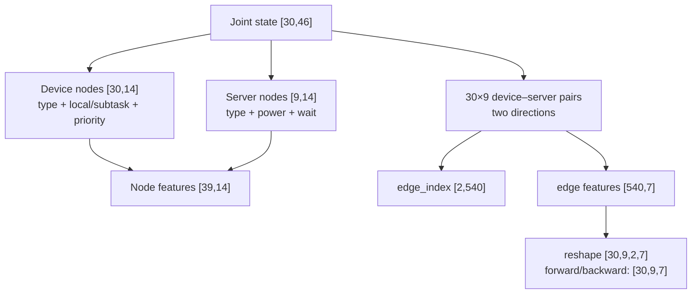
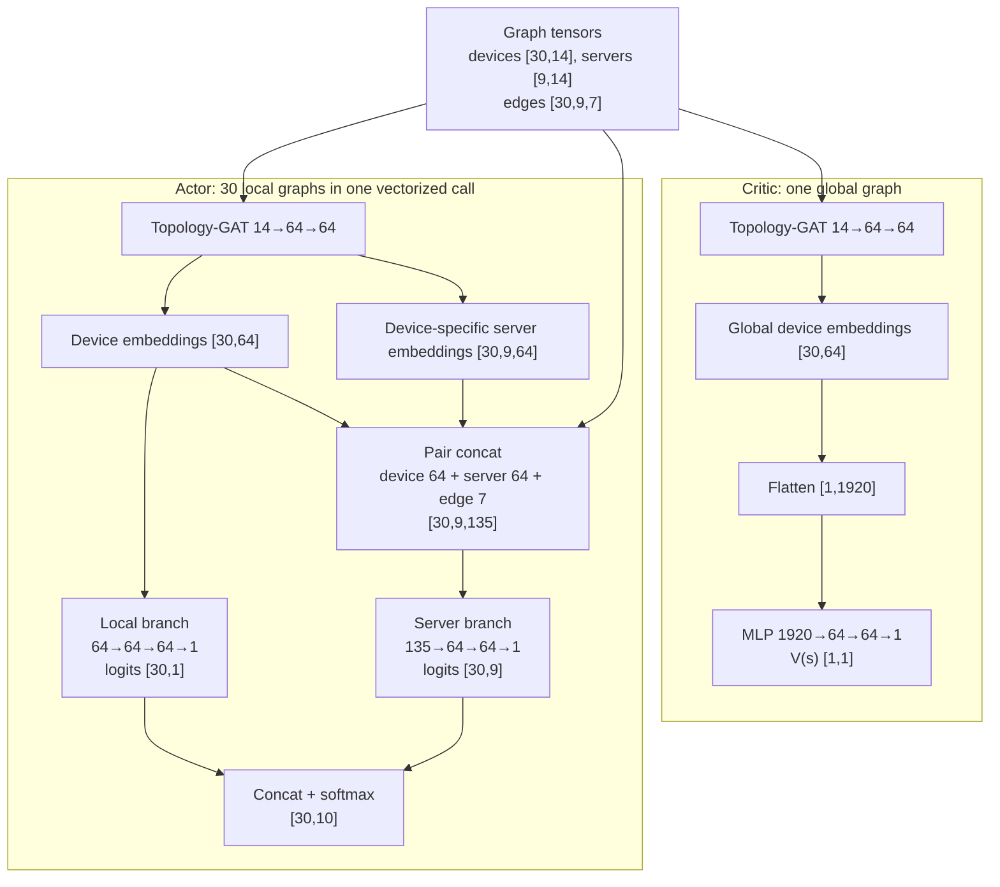
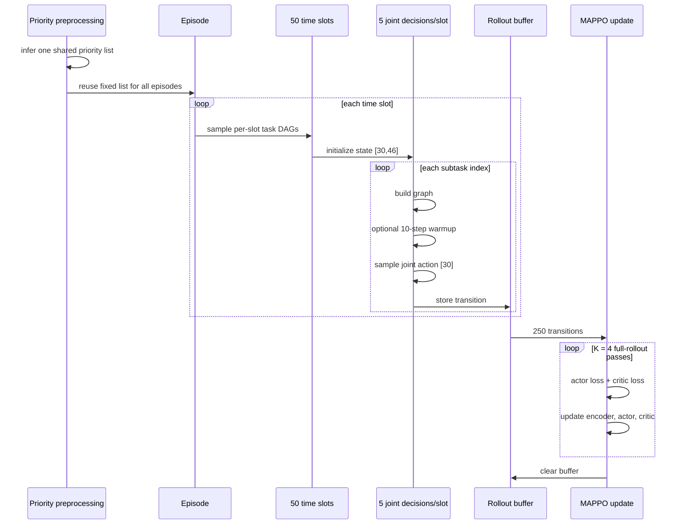

# Dual-GAT MAPPO Architecture

This document describes the **current implementation**, using the large topology
as the running example. It is the primary architecture reference and should be
updated whenever the model or training procedure changes.
Select this 30-device/9-server scenario with
`--topology-scenario large_30d_9s` when running `run_comparision.py`.

## 1. Configuration and end-to-end flow

| Symbol | Meaning | Value |
|---|---|---:|
| `D` | device agents | 30 |
| `S` | edge servers | 9 |
| `M` | subtasks per DAG | 5 |
| `A=S+1` | actions per device: local + servers | 10 |
| `T` | time slots per episode | 50 |
| `L=T×M` | joint transitions per episode | 250 |
| `H`, `Z` | topology-GAT hidden/embedding widths | 64, 64 |
| `K` | PPO passes over one rollout | 4 |



The two GATs have separate roles:

- **Task-GAT** scores the subtasks used to form a priority order. It is
  pretrained and frozen. One representative DAG is inferred before the RL
  episode loop, and the resulting list is reused for every device and slot.
- **Topology-GAT** represents device–server connectivity. Its weights are shared
  by the actor and critic paths and are jointly optimized by MAPPO.

## 2. Task priority and environment state

Task-GAT/GCN receives five nodes from one representative DAG:

```text
Min-max normalized task node features [5,6]
  columns = [hierarchy level, out-degree, cumulative successor CPU,
             own CPU, input size, result size]

Adjacency [5,5]
  current DAG: 1→2, 1→3, 2→4, 3→4, 4→5

[5,6] → GAT(6→32) → [5,32]
      → GAT(32→32) → [5,32]
      → Linear(32→1) → scores [5,1]
      → highest-scoring ready-node topological sort
      → one shared priority list[5]
```

Supervised targets use the normalized upward CPU rank
`rank(v)=CPU(v)+max rank(successor)`. Tasks 2 and 3 remain parallel, but their
workloads are now asymmetric: task 2 uses 50 cycles/pixel and task 3 uses 250
cycles/pixel before the configured CPU scale is applied. Their relative order is
inferred from the model scores and representative DAG; `1→3→2→4→5` is a
possible result, not a hard-coded guarantee. The offloading actor still decides
local versus edge.

Saved-policy inference is handled by `inference_priority_comparison.py`. It
compares the fixed inferred order against `1→2→3→4→5` using deterministic
greedy actions, identical task seeds, and no optimizer or warmup updates.
For training ablations, `run_comparision.py --task-priority off` bypasses the
task graph model and uses the default DAG-safe order `1→2→3→4→5`.

The environment then builds one 46-dimensional state per device:

| Slice | Shape | Content |
|---|---:|---|
| `0:5` | `[5]` | local power/wait and current subtask CPU/input/result size |
| `5:10` | `[5]` | normalized priority ranks for the complete DAG |
| `10:19` | `[9]` | server compute powers |
| `19:28` | `[9]` | server waiting times |
| `28:37` | `[9]` | connection-window starts |
| `37:46` | `[9]` | connection-window ends |

The state exposes DT estimates `f_hat`. Physical execution reconstructs
`delta_f = f_hat - f` and `f = f_hat - delta_f`; estimated delay plus its
deviation therefore equals `CPU/f`. Local computation energy uses
`tau × CPU × f²`; edge-server computation energy is temporarily excluded, so
offloaded execution contributes transmission energy only. Current compute
ranges are 0.8–1.2 GHz for devices and
2.3–2.5 GHz for servers. Both device and server DT estimates use independent
uniform relative errors in `[-5%, 5%]` at each time slot. Reward weights are
`(lambda1,...,lambda5)=(5,5,5,5,1)`, the failed-offload penalty is `-1`,
and sampled task CPU demand is scaled by `1.4`.

Thus the joint state is `[D,46] = [30,46]`. One joint action completes the
current subtask for all 30 devices, increments their subtask indices, and returns
a new `[30,46]` state. A slot therefore contains five state transitions, not one:

```text
S₁ᵗ → A₁ᵗ → S₂ᵗ → ... → A₅ᵗ → S₆ᵗ
```

## 3. State-to-graph transformation



Each directed edge has seven features:

```text
[direction_1, direction_2, connected, disconnected,
 window_start, window_end, window_length]
```

The graph contains all 270 device–server pairs, including disconnected pairs.
Unmasked Graph-GAT variants set `use_action_mask=False`, so disconnected server
actions remain in the policy distribution and are handled by the environment.
Mask variants set `use_action_mask=True`; this choice is independent of the
30-device/9-server topology.

Each Topology-GAT layer applies:

```text
node projection:      F_in → F_out
edge projection:      7 → F_out
attention projection: 3F_out → 1

attention(u→v) = LeakyReLU(Wa [Wn xu || Wn xv || We euv])
message(u→v)   = Wn xu + We euv
output(v)      = Σu softmax(attention(u→v)) × message(u→v)
```

The encoder has two layers: `14→64`, ELU, then `64→64`.

### Lightweight topology ablation

The optional lightweight representation is implemented in the graph builder and
agent, but `Lightweight Graph-GAT Warmup MAPPO` is not currently registered in
`build_algorithm_configs()`. When instantiated with the same training settings,
it keeps the node features, actor/critic structure, reward, and rollout length
while compressing the topology representation:

| Component | Standard | Lightweight |
|---|---:|---:|
| topology edges | `[2,540]` | `[2,270]` |
| edge features | `[540,7]` | `[270,3]` |
| direction | device↔server | server→device |
| edge columns | direction flags, connection flags, start/end/length | connected, start, length |
| Topology-GAT | `14→64→64` | `14→64` |

Server→device is retained because each device embedding needs messages from the
nine candidate servers. The reverse edge is omitted, and the one-layer encoder
returns projected server embeddings directly to the actor. For `D=30, S=9`,
stored edge scalars fall from `540×7=3,780` to `270×3=810` per graph.

## 4. Actor and critic tensor paths



The actor sees one local graph per device: that device, all nine servers, and
their edges. The critic sees one global graph in which every server aggregates
messages from all 30 devices. Both paths reuse the same Topology-GAT parameters.

In the lightweight variant, `L1/G1` above becomes `14→64`, and the actor pair
width becomes `64+64+3=131` instead of 135.

Action collection produces:

```text
probabilities [30,10]
  → 30 Categorical distributions
  → joint actions [30] + old log-probabilities [30]
```

The deployment policy requires only the topology encoder and actor: **27,586
parameters**. The centralized critic is training-only.

## 5. Warmup, rollout, and MAPPO update

For Warmup variants, ten auxiliary updates are performed before each joint
action during the first five episodes. Warmup and MAPPO therefore coexist;
MAPPO is active from episode 1. Non-Warmup variants perform no auxiliary updates.

```text
Local embeddings:
  device [30,64], server [30,9,64]
  → pair embeddings [30,9,128]
  → MLP 128→64→64
  → feasibility logits [30,9]
  → window estimates [30,9]

L_aux = BCEWithLogits(feasibility) + 0.5 × MSE(window length)
```

Warmup updates `Topology-GAT + warmup head`; it does not update the actor or
critic. After episode 5, only the auxiliary updates stop.



After a complete episode, stacked rollout shapes are:

| Tensor | Shape |
|---|---:|
| actions, rewards, old log-probabilities | `[250,30]` |
| dones, team rewards, values, TD targets, advantages | `[250,1]` |
| device node batch | `[250,30,14]` |
| server node batch | `[250,9,14]` |
| forward/backward edge batches | `[250,30,9,7]` |
| actor probabilities | `[250,30,10]` |
| global critic embeddings | `[250,30,64]` |

The default advantage is a normalized **one-step TD advantage**:

```text
team_reward_l = mean_i reward_l,i                         [250,1]
target_l = team_reward_l + γ V(next_l)(1-done_l)          [250,1]
advantage_l = normalize(target_l - V(current_l))          [250,1]

ratio = exp(new_log_prob - old_log_prob)                  [250,30]
actor loss = PPO clipped objective - entropy bonus
critic loss = MSE(V(current), target)
```

`utils/rl_advantages.py` also provides GAE(λ), selected by `--use-gae` and
applied identically to every MAPPO-family agent:

```text
δ_l = team_reward_l + γ V(s_{l+1})(1-done_l) - V(s_l)
A_l = δ_l + γλ(1-done_l) A_{l+1}
target_l = A_l + V(s_l)                                   λ-return
advantage_l = normalize(A_l)                              full-batch
```

`λ` is fixed at `0.95` in `paper_config.py` and is not tuned, so enabling it
changes every variant the same way. GAE reads `V(s_{l+1})` from the next stored
transition rather than from the stored next state, so the slot-boundary caveat
below only affects the single terminal bootstrap. It also halves the critic
encoder passes per update, from `2×250` to `251`.

By default each PPO epoch processes the full 250-transition rollout.
`--num-minibatches M` shuffles the rollout once per epoch and takes `M`
optimizer steps instead of one; advantages are still normalized over the
complete rollout before the split. `M=1` reproduces the full-batch behaviour
exactly, including the unshuffled ordering.

For the lightweight variant, one compact edge batch `[250,30,9,3]` is reused by
the optimized encoder API; no second direction is stored in the graph state.

### Shared MAPPO comparison baseline

`Shared MAPPO` and `Shared Mask MAPPO` are the canonical MAPPO recipe for
homogeneous agents, added so the Graph-GAT policy can be compared against an
MLP policy under the *same* centralized-training structure:

| Component | `MAPPO` baseline | `Shared MAPPO` | `Graph-GAT MAPPO` |
|---|---|---|---|
| actors | 30 separate networks | **1 shared** | 1 shared |
| critics | 30 copies of `V_i(s)` | **1 `V(s)`** | 1 `V(s)` |
| advantage | per-agent reward `r_i` | **team mean** | team mean |
| observation encoder | MLP over the flat state | MLP over the flat state | topology GAT |

The existing `MAPPO` entry keeps per-agent actors, per-agent critics, and
per-agent rewards; it is closer to independent PPO with a centralized critic
than to MAPPO with parameter sharing. `Shared MAPPO` and `Graph-GAT MAPPO`
both use a shared actor, one team-value critic, and mean team reward. The
comparison also includes different action-scoring heads: the flat-state MLP
outputs all action logits, while the graph actor scores local execution and
each device–server pair separately.

```text
Actor:  device state [46] → MLP 46→64→64→10 → softmax   (shared by 30 devices)
Critic: joint state [1380] → MLP 1380→64→64→1           (one team value)
```

### GATMA comparison baseline

`GATMA` is adapted to the same DITEN task while preserving its paper-level
learning design. Devices remain the 30 agents, and the action remains one of 10
offloading locations; channel, transmit-power, and cloud actions are omitted.

```text
Actor per device:
  local device-server graph → MLP 14→64
  → one 4-head GAT (concatenated width 64)
  → MLP 64→64→10 → epsilon-greedy action

Critic per device:
  global nodes + joint one-hot actions
  → MLP 24→64 → one 4-head GAT → global mean pool
  → MLP 64→64→1 → Q_i(s,A)
```

GATMA uses a replay capacity of 100,000, batch size 128, actor/critic learning
rates `1e-4/1e-5`, `gamma=0.95`, `tau=0.01`, and epsilon decay `0.99→0.01`.
One synchronized replay update is attempted after each complete time slot (five
joint subtask decisions). Each device owns separate online and target networks.

## 6. Parameter and gradient ownership

| Module | Parameters | Updated by |
|---|---:|---|
| frozen Task-GAT | 1,377 | separate pretraining only |
| Topology-GAT encoder | 6,272 | auxiliary warmup and MAPPO |
| shared actor | 21,314 | MAPPO actor loss |
| centralized critic | 127,169 | MAPPO critic loss |
| warmup head | 12,546 | auxiliary warmup only |
| lightweight Topology-GAT encoder | 1,280 | auxiliary warmup and MAPPO |
| lightweight shared actor | 21,058 | MAPPO actor loss |
| GATMA actor ×30 | 299,820 | deterministic policy gradient |
| GATMA critic ×30 | 301,470 | TD Q-loss |

```text
MAPPO-optimized parameters       = 154,755
Warmup variant active parameters = 167,301
Deployment parameters            = 27,586  (encoder + actor)
Lightweight deployment parameters = 22,338 (encoder + actor)
```

During PPO, actor-loss gradients reach the shared encoder through the local
path, while critic-loss gradients reach it through the global path. The two
gradients are combined in the same backward pass.

## 7. Implementation caveats

1. **Priority order:** the highest-scoring ready-node sort respects DAG
   dependencies. The environment also validates the resulting order.
2. **Warmup behavior policy:** during the first five episodes, auxiliary steps
   modify the encoder while the rollout is being collected; the behavior policy
   is therefore not fixed throughout those episodes.
3. **Slot boundary:** the stored next graph after subtask 5 is generated before
   the next slot's new DAG is initialized, so it is not the actual graph used by
   the following decision. One-step TD reads this stored graph at every slot
   boundary; GAE reads it only for the terminal bootstrap.
4. **PPO variant:** the default update uses one-step TD targets, no full
   returns, and a single full-batch step per epoch. GAE(λ=0.95) and
   `M`-way minibatching are available through `--use-gae` and
   `--num-minibatches`, and both are off by default so earlier runs reproduce.
5. **Warmup sampling:** auxiliary warmup uses all current device–server pairs;
   there is no `same_class=True` sampling step in the current implementation.
6. **Tuned profile:** `--hyperparameters-dir` loads and validates a saved
   profile, but the runner currently passes `tuned_hyperparameters=None` to
   `build_algorithm_configs()`, so that CLI path does not apply the stored
   8-epoch / 20-episode / 4-update values to the agents.

## 8. Where each shape is defined

```text
run_comparision.py
  algorithm name/config and edge_feature_dim=7 or 3
        ↓
utils/topology_graph_state.py :: build_topology_graph_state()
  [D,state_dim] → nodes [D+S,14] and edges [2DS,7] or [DS,3]
        ↓
baselines/graph_gat_mappo.py :: GraphGATMAPPOAgent
  reshapes edges to device×server pairs; coordinates warmup, action selection, PPO
        ↓
models/topology_gat.py :: TopologyGATEncoder
  standard 14→64→64 or lightweight 14→64 message passing

models/graph_gat_heads.py
  shared actor, centralized critic, optional topology warmup head
baselines/graph_gat_rollout.py
  on-policy graph transition and rollout buffer

baselines/gatma.py + utils/gatma_training.py
  separate 4-head Actor-GAT/Q-Critic per device + replay/target updates

utils/rl_advantages.py
  one-step TD, GAE(lambda), full-batch normalization, minibatch indices
        ↓
baselines/mappo.py, baselines/shared_mappo.py, baselines/graph_gat_mappo.py
  every MAPPO-family agent shares the same estimator and minibatch loop
```

`540` and `270` are runtime edge counts (`2×D×S` and `D×S`), so searching only
for the literal number will not find them. Search for `build_topology_graph_state`,
`edge_feature_dim`, `lightweight_topology`, or `class TopologyGATEncoder`.

The runner uses Python with NumPy, PyTorch, and Pillow. `requirements.txt`
lists Pillow and plotting packages; PyTorch and NumPy must also be available in
the runtime environment. The KolektorSDD loader uses synthetic task parameters
when the image dataset is unavailable; W&B and Optuna have separate optional
requirements files.
