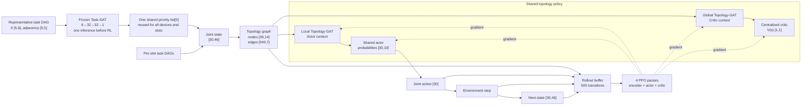
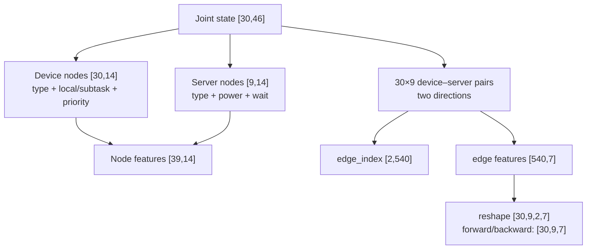
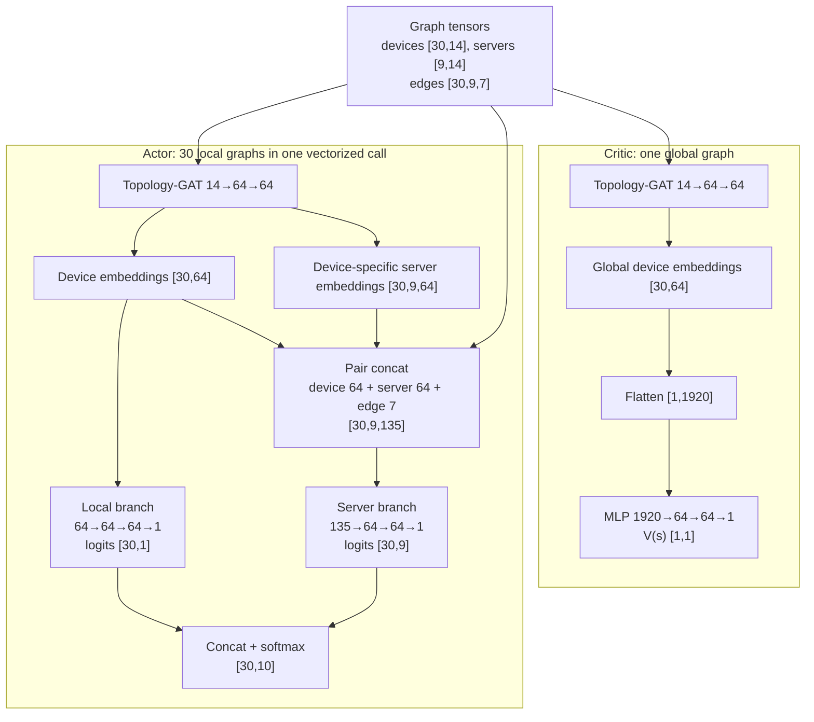
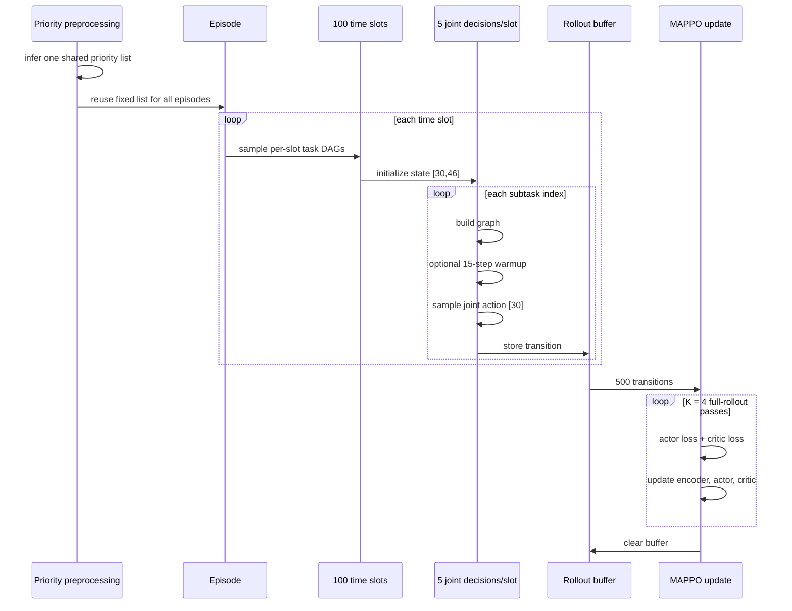

# Dual-GAT MAPPO Architecture

This document describes the **current implementation**, using the large topology
as the running example. It is the primary architecture reference and should be
updated whenever the model or training procedure changes.
Select this 30-device/9-server scenario with
`--topology-scenario large_30d_9s` when running `run_comparision.py`.

> **Code locations:**
>
> - Scenario selection: [run_comparision.py:121–140](../run_comparision.py#L121-L140).
> - Large topology: [utils/topology_scenarios_config.py:187–204](../utils/topology_scenarios_config.py#L187-L204).

### Industrial topology variants

The legacy `large_30d_9s` scenario remains unchanged so earlier checkpoints
and experiment results stay reproducible. New experiments that need a more
realistic factory layout can select `large_industrial_30d_9s`. It uses a
180 m × 120 m floor, 15 partially overlapping rectangular aisle loops, 30
mobile devices, and nine servers placed near aisle intersections and production
zones. The arrangement is structured but deliberately asymmetric.

> **Code locations:**
>
> - Industrial routes: [utils/topology_scenarios_config.py:85–103](../utils/topology_scenarios_config.py#L85-L103).
> - Industrial layout: [utils/topology_scenarios_config.py:205–224](../utils/topology_scenarios_config.py#L205-L224).

Each scenario resolves one coverage radius per server. Unless explicit radii
are configured as described below, coverage is sampled once when the scenario
is built, then remains fixed for the entire comparison
so every algorithm sees the same physical system. `--topology-seed` reproduces
the sampled radii and `--server-profile` selects:

- `scenario`: the intended default (`heterogeneous` for the industrial map and
  `uniform` for legacy maps);
- `uniform`: the scenario's nominal radius for every server;
- `heterogeneous`: deterministic radii from 83.3% to 111.1% of nominal; and
- `stress`: deterministic radii from 66.7% to 83.3% of nominal.

> **Code locations:**
>
> - Coverage profiles: [utils/topology_scenarios_config.py:134–155](../utils/topology_scenarios_config.py#L134-L155).
> - Resolve scenario radii: [utils/topology_scenarios_config.py:254–282](../utils/topology_scenarios_config.py#L254-L282).

For the industrial scenario the nominal radius is 18 m, so the heterogeneous
range is 15–20 m and the stress range is 12–15 m. With seed 2026, the default
heterogeneous layout has route-sampled average feasible servers 0.58,
zero-link ratio 0.44, and multi-link ratio 0.02. These metrics describe the
configured geometry; they are not training results.

> **Code locations:**
>
> - Geometry metrics: [utils/topology_scenarios_config.py:359–401](../utils/topology_scenarios_config.py#L359-L401).

```bash
python run_comparision.py \
  --topology-scenario large_industrial_30d_9s \
  --topology-seed 2026 \
  --server-profile scenario
```

The approved `modular_cells_30d_9s` variant uses the same 180 m × 120 m floor,
with three distinct modules, 15 routes, 30 devices, and nine servers. Module A
has grouped cells, B has staggered horizontal cells, and C has mixed vertical
cells. Each route carries two devices starting at opposite corners. Every
training episode resets both devices to those same corners and replays the
route from its beginning. In `utils/topology/scenarios.py`, edit
`modular_cell_routes()` to change
`rectangle(left, bottom, right, top)` bounds, and edit the named scenario's
`server_locations` and `coverage_radii` to change server positions and radii.
Coordinates and radii are in metres; server entries follow S1 through S9.

> **Code locations:**
>
> - Module routes: [utils/topology_scenarios_config.py:106–131](../utils/topology_scenarios_config.py#L106-L131).
> - Server layout and device starts: [utils/topology_scenarios_config.py:225–318](../utils/topology_scenarios_config.py#L225-L318).

This variant's default `heterogeneous` profile uses explicit radii
`(12, 15, 12, 12, 15, 12, 12, 15, 12)` rather than sampling them again.
S2, S5, and S8 therefore remain at 15 m, regardless of topology seed. Both
`--server-profile scenario` and `--server-profile heterogeneous` preserve these
values. Explicit `uniform` or `stress` overrides instead use the nominal 12 m
radius and the profile rules above. Plot the editable configuration from the
`Industrial_task_offloading` directory with:

```bash
python -m utils.topology.preview \
  --scenarios modular_cells_30d_9s \
  --server-profile scenario \
  --output-dir results/topology_preview/modular_cells
```

> **Code locations:**
>
> - Explicit radii and overrides: [utils/topology_scenarios_config.py:240–270](../utils/topology_scenarios_config.py#L240-L270).
> - Preview CLI: [utils/topology_scenario_preview.py:223–261](../utils/topology_scenario_preview.py#L223-L261).

Select it for a future experiment with `--topology-scenario modular_cells_30d_9s`.
Adding the scenario does not change the experiment's default topology.

The training application still has three model-facing layers: environment/data
resolves workloads, geometry, and connection windows; algorithms consume the
resulting state/graph; and experiment/output records metadata and artifacts.
The local-first storage workflow has four narrower responsibilities: CLI path
selection, strict local dataset loading, local run publication, and post-run
Drive synchronization. The learned model roles are unchanged: the frozen
Task-GAT produces task priority and the trainable topology policy/critic
consumes connectivity. Storage and topology changes do not add a neural-network
role. `run_comparision.py` keeps the CLI, action collection, agent updates,
training loop, and run orchestration. `utils/comparison/setup.py` owns
seeding and scenario construction; `utils/comparison/algorithm_config.py`
builds agent settings; `utils/comparison/diagnostics.py` and
`utils/comparison/tracking.py` format diagnostics and episode records; and
`utils/comparison/evaluation.py` evaluates saved checkpoints. The runner
imports these helpers, so this module split does not change model roles,
training order, or configured hyperparameters. The remaining utilities are
grouped under `utils/topology/` (scenarios and graph state),
`utils/task_priority/` (DAG and priority model helpers),
`utils/training/` (agent update helpers), and `utils/reporting/`
(plots and summaries). Shared paper parameters, metrics, and GPU readiness
remain directly under `utils/`.

> **Code locations:**
>
> - Environment state: [environment/diten_env.py:938–993](../environment/diten_env.py#L938-L993).
> - Algorithm/model construction: [baselines/graph_gat_mappo.py:42–179](../baselines/graph_gat_mappo.py#L42-L179).
> - Output publication: [utils/comparison_outputs.py:245–296](../utils/comparison_outputs.py#L245-L296).

### Local-first dataset and artifact flow

`run_comparision.py` reads only the project-local KolektorSDD replica selected
by `--dataset-path` (default `dataset/KolektorSDD`). Missing or empty data is a
startup error. Synthetic data is available only when an intentional smoke run
passes `--allow-dummy-data`. Dataset mode, resolved path, input-image count, and
mean pixel count are recorded with topology metadata in W&B, JSONL rows, and
model checkpoints.

> **Code locations:**
>
> - Dataset validation and statistics: [dataset/data_loader.py:42–163](../dataset/data_loader.py#L42-L163).
> - Runner dataset loading: [run_comparision.py:2573–2578](../run_comparision.py#L2573-L2578).
> - Dataset metadata: [utils/comparison_outputs.py:54–63](../utils/comparison_outputs.py#L54-L63).
> - Checkpoint metadata: [utils/comparison_outputs.py:212–241](../utils/comparison_outputs.py#L212-L241).

Plots, CSV/JSONL histories, and model checkpoints are first written below
`--local-output-root` (default `plots`). When `--drive-artifact-root` or
`TASK_OFFLOADING_DRIVE_ROOT` is configured, the runner copies the completed run
directory to `<Drive root>/runs` only after all algorithms finish and all local
files close. A temporary Drive-side directory is renamed only after the copy
succeeds; the local run remains available if synchronization fails.

> **Code locations:**
>
> - Local publication and Drive synchronization: [run_comparision.py:2811–2837](../run_comparision.py#L2811-L2837).
> - Atomic copy/rename: [utils/artifact_sync.py:42–56](../utils/artifact_sync.py#L42-L56).


```mermaid
flowchart LR
    GD["Google Drive dataset"] -->|explicit replica refresh| LD["Project-local KolektorSDD"]
    LD --> TRAIN["Comparison training"]
    TRAIN --> LOCAL["Completed local run<br/>plots + histories + checkpoints"]
    LOCAL -->|post-run copy| TEMP["Drive temporary run"]
    TEMP -->|rename after successful copy| RUNS["Drive runs directory"]
```

## 1. Configuration and end-to-end flow

| Symbol | Meaning | Value |
|---|---|---:|
| `D` | device agents | 30 |
| `S` | edge servers | 9 |
| `M` | subtasks per DAG | 5 |
| `A=S+1` | actions per device: local + servers | 10 |
| `T` | time slots per episode | 100 |
| `L=T×M` | joint transitions per episode | 500 |
| `H`, `Z` | topology-GAT hidden/embedding widths | 64, 64 |
| `K` | PPO passes over one rollout | 4 |

> **Code locations:**
>
> - Device/server counts: [utils/topology_scenarios_config.py:187–204](../utils/topology_scenarios_config.py#L187-L204).
> - Five-subtask DAG: [utils/experiment_setup.py:74–86](../utils/experiment_setup.py#L74-L86).
> - Time slots and model/PPO settings: [utils/paper_config.py:16–89](../utils/paper_config.py#L16-L89).


```mermaid
flowchart LR
    TEMPLATE["Representative task DAG<br/>X [5,6], adjacency [5,5]"]
    TGAT["Frozen Task-GAT<br/>6→32→32→1<br/>one inference before RL"]
    ORDER["One shared priority list[5]<br/>reused for all devices and slots"]
    DAG["Per-slot task DAGs"]
    STATE["Joint state<br/>[30,46]"]
    GRAPH["Topology graph<br/>nodes [39,14]<br/>edges [540,7]"]

    subgraph POLICY["Shared topology policy"]
        LGAT["Local Topology-GAT<br/>Actor context"]
        ACTOR["Shared actor<br/>probabilities [30,10]"]
        GGAT["Global Topology-GAT<br/>Critic context"]
        CRITIC["Centralized critic<br/>V(s) [1,1]"]
    end

    ACTION["Joint action [30]"]
    ENV["Environment step"]
    NEXT["Next state [30,46]"]
    BUFFER["Rollout buffer<br/>500 transitions"]
    PPO["4 PPO passes<br/>encoder + actor + critic"]

    TEMPLATE --> TGAT --> ORDER --> STATE
    DAG --> STATE --> GRAPH
    GRAPH --> LGAT --> ACTOR --> ACTION --> ENV --> NEXT
    GRAPH --> GGAT --> CRITIC
    GRAPH --> BUFFER
    ACTION --> BUFFER
    ENV --> BUFFER
    NEXT --> BUFFER
    BUFFER --> PPO
    PPO -.gradient.-> LGAT
    PPO -.gradient.-> GGAT
    PPO -.gradient.-> ACTOR
    PPO -.gradient.-> CRITIC
```

The two GATs have separate roles:

- **Task-GAT** scores the subtasks used to form a priority order. It is
  pretrained and frozen. One representative DAG is inferred before the RL
  episode loop, and the resulting list is reused for every device and slot.
- **Topology-GAT** represents device–server connectivity. Its weights are shared
  by the actor and critic paths and are jointly optimized by MAPPO.

> **Code locations:**
>
> - Priority pretraining: [utils/priority_model_training.py:101–139](../utils/priority_model_training.py#L101-L139).
> - Fixed priority inference: [run_comparision.py:2600–2623](../run_comparision.py#L2600-L2623).
> - Shared topology encoder: [baselines/graph_gat_mappo.py:128–179](../baselines/graph_gat_mappo.py#L128-L179).

## 2. Task priority and environment state

Task-GAT/GCN receives five nodes from one representative DAG:

```text
Min-max normalized task node features [5,6]
  columns = [hierarchy level, out-degree, cumulative successor CPU,
             own CPU, input size, result size]

Adjacency [5,5]
  current DAG: 1→2, 1→3, 2→4, 3→4, 4→5

[5,6] → GAT(6→32) → [5,32]
      → GAT(32→32) → [5,32]
      → Linear(32→1) → scores [5,1]
      → highest-scoring ready-node topological sort
      → one shared priority list[5]
```

> **Code locations:**
>
> - Task features and normalization: [utils/graph_utils.py:100–130](../utils/graph_utils.py#L100-L130).
> - Task-GAT layers: [models/task_priority_gat.py:59–83](../models/task_priority_gat.py#L59-L83).
> - DAG dependencies: [utils/experiment_setup.py:16–17](../utils/experiment_setup.py#L16-L17).
> - Priority sort and broadcast: [utils/experiment_setup.py:143–187](../utils/experiment_setup.py#L143-L187).

Supervised targets use the normalized upward CPU rank
`rank(v)=CPU(v)+max rank(successor)`. Tasks 2 and 3 remain parallel, but their
workloads are now asymmetric: task 2 uses 50 cycles/pixel and task 3 uses 250
cycles/pixel before the configured CPU scale is applied. Their relative order is
inferred from the model scores and representative DAG; `1→3→2→4→5` is a
possible result, not a hard-coded guarantee. The offloading actor still decides
local versus edge.

> **Code locations:**
>
> - Upward-rank targets: [utils/priority_model_training.py:30–75](../utils/priority_model_training.py#L30-L75).
> - Task 2/3 CPU workloads: [dataset/data_loader.py:116–125](../dataset/data_loader.py#L116-L125).

Saved-policy inference is handled by `inference_priority_comparison.py`. It
compares the fixed inferred order against `1→2→3→4→5` using deterministic
greedy actions, identical task seeds, and no optimizer or warmup updates.
For training ablations, `run_comparision.py --task-priority off` bypasses the
task graph model and uses the default DAG-safe order `1→2→3→4→5`.

> **Code locations:**
>
> - Saved-policy evaluation: [inference_priority_comparison.py:266–309](../inference_priority_comparison.py#L266-L309).
> - Priority-off order: [run_comparision.py:2621–2623](../run_comparision.py#L2621-L2623).

The environment then builds one 46-dimensional state per device:

| Slice | Shape | Content |
|---|---:|---|
| `0:5` | `[5]` | local power/wait and current subtask CPU/input/result size |
| `5:10` | `[5]` | normalized priority ranks for the complete DAG |
| `10:19` | `[9]` | server compute powers |
| `19:28` | `[9]` | server waiting times |
| `28:37` | `[9]` | connection-window starts |
| `37:46` | `[9]` | connection-window ends |

> **Code locations:**
>
> - State dimension: [environment/diten_env.py:742–756](../environment/diten_env.py#L742-L756).
> - All state slices and concatenation: [environment/diten_env.py:938–993](../environment/diten_env.py#L938-L993).

The state exposes DT estimates `f_hat`. Physical execution reconstructs
`delta_f = f_hat - f` and `f = f_hat - delta_f`; estimated delay plus its
deviation therefore equals `CPU/f`. Local computation energy uses
`tau × CPU × f²`; edge-server computation energy is temporarily excluded, so
offloaded execution contributes transmission energy only. Consecutive
subtasks placed on different edge servers are assumed to use a direct
inter-server link with negligible transfer delay and energy; the simulator
currently records both as zero. This is a modeling assumption, not a measured
backhaul property. Current compute ranges are 0.8–1.2 GHz for devices and
2.3–2.5 GHz for servers. Both device and server DT estimates use independent
uniform relative errors in `[-5%, 5%]` at each time slot. Reward weights are
`(lambda1,...,lambda5)=(5,5,5,5,1)`, the failed-offload penalty is `-1`,
and sampled task CPU demand is scaled by `1.4`.

> **Code locations:**
>
> - Physical compute and energy: [environment/network_env.py:67–123](../environment/network_env.py#L67-L123).
> - DT estimates and error sampling: [environment/digital_twin.py:57–103](../environment/digital_twin.py#L57-L103).
> - Reward/error/compute/CPU-scale settings: [utils/paper_config.py:46–62](../utils/paper_config.py#L46-L62).

Thus the joint state is `[D,46] = [30,46]`. One joint action completes the
current subtask for all 30 devices, increments their subtask indices, and returns
a new `[30,46]` state. A slot therefore contains five state transitions, not one:

```text
S₁ᵗ → A₁ᵗ → S₂ᵗ → ... → A₅ᵗ → S₆ᵗ
```

> **Code locations:**
>
> - Environment step and slot completion: [environment/diten_env.py:268–304](../environment/diten_env.py#L268-L304).
> - Subtask completion and index advancement: [environment/diten_env.py:572–602](../environment/diten_env.py#L572-L602).

## 3. State-to-graph transformation


```mermaid
flowchart TD
    STATE["Joint state [30,46]"]
    DN["Device nodes [30,14]<br/>type + local/subtask + priority"]
    SN["Server nodes [9,14]<br/>type + power + wait"]
    NODES["Node features [39,14]"]
    PAIRS["30×9 device–server pairs<br/>two directions"]
    EI["edge_index [2,540]"]
    EF["edge features [540,7]"]
    ER["reshape [30,9,2,7]<br/>forward/backward: [30,9,7]"]

    STATE --> DN --> NODES
    STATE --> SN --> NODES
    STATE --> PAIRS --> EI
    PAIRS --> EF --> ER
```

> **Code locations:**
>
> - Graph construction and node features: [utils/topology_graph_state.py:23–122](../utils/topology_graph_state.py#L23-L122).
> - Pair reshape and directed edge tensors: [baselines/graph_gat_mappo.py:418–447](../baselines/graph_gat_mappo.py#L418-L447).

Each directed edge has seven features:

```text
[direction_1, direction_2, connected, disconnected,
 window_start, window_end, window_length]
```

> **Code locations:**
>
> - Seven edge features and both directed edges in `_build_valid_connection_edges()`: [utils/topology_graph_state.py:125–182](../utils/topology_graph_state.py#L125-L182).

The graph contains all 270 device–server pairs, including disconnected pairs.
Unmasked Graph-GAT variants set `use_action_mask=False`, so disconnected server
actions remain in the policy distribution and are handled by the environment.
Mask variants set `use_action_mask=True`; this choice is independent of the
30-device/9-server topology.

> **Code locations:**
>
> - Masked/unmasked configurations: [run_comparision.py:698–738](../run_comparision.py#L698-L738).
> - Action-mask behavior: [baselines/graph_gat_mappo.py:537–555](../baselines/graph_gat_mappo.py#L537-L555).
> - Offload feasibility and fallback: [environment/diten_env.py:398–519](../environment/diten_env.py#L398-L519).

Each Topology-GAT layer applies:

```text
node projection:      F_in → F_out
edge projection:      7 → F_out
attention projection: 3F_out → 1

attention(u→v) = LeakyReLU(Wa [Wn xu || Wn xv || We euv])
message(u→v)   = Wn xu + We euv
output(v)      = Σu softmax(attention(u→v)) × message(u→v)
```

> **Code locations:**
>
> - Projections, attention, messages, and aggregation: [models/topology_gat.py:19–70](../models/topology_gat.py#L19-L70).

The encoder has two layers: `14→64`, ELU, then `64→64`.

> **Code locations:**
>
> - Two-layer encoder and ELU: [models/topology_gat.py:472–530](../models/topology_gat.py#L472-L530).

### Separate PyG-GAT MAPPO experiment (2026-10-04)

**Implemented:** `PyG-GAT MAPPO`, `PyG-GAT Mask MAPPO`,
`PyG-GAT Warmup MAPPO`, and `PyG-GAT Warmup Mask MAPPO` are explicitly selected
comparison variants.
The existing custom `Graph-GAT MAPPO` encoder remains the default. All four variants
use the same controller, actor/critic heads, rollout buffer, and PPO estimator
settings. The new encoder uses PyTorch Geometric `GATConv`, not custom attention
or message aggregation. Task-priority GAT remains unchanged.

At the registered default widths, the PyG topology encoder has two single-head
layers `14→64→64`, with ELU between them, `edge_dim=7`, dropout 0, LeakyReLU slope 0.2, no output bias, and
no residual projection. Self-loops receive zero-valued edge attributes to match
the custom encoder. Edge attributes influence attention; messages contain
projected node features rather than the custom `Wn xu + We euv` messages.
This is an edge-aware library GAT ablation, not an edge-free original-GAT
reproduction. Initialization follows each implementation's own defaults.

The actor batches independent one-device/all-server graphs and returns device
embeddings `[T,N,64]` and server embeddings `[T,N,S,64]`. The critic batches
complete topologies and returns device embeddings `[T,N,64]`. Node-index offsets
prevent messages crossing local graphs or timesteps. Both paths share the PyG
encoder weights. `PyG-GAT MAPPO` matches unmasked, no-warmup `Graph-GAT MAPPO`;
`PyG-GAT Mask MAPPO` matches masked, no-warmup `Graph-GAT Mask MAPPO`.
`PyG-GAT Warmup MAPPO` and `PyG-GAT Warmup Mask MAPPO` copy their
corresponding custom Warmup configurations. Only the encoder backend differs
within each comparison pair. Warmup uses the shared auxiliary head and loss,
updating the PyG encoder and auxiliary head before action sampling; PPO continues
from the first episode. Its Adam learning rate is 0.001, with 15 auxiliary updates
per step during the first 15 episodes. Auxiliary updates have no gradient clipping;
PPO clips the combined encoder/actor/critic norm to 0.3.
See [variant registration](../utils/comparison/algorithm_config.py#L261) and
[shared warmup update](../baselines/graph_gat_mappo.py#L336).
The three current commands in [note.txt](../note.txt#L10) include all four PyG variants. The mask applies
to action probabilities in both sampling and PPO updates: disconnected server
actions receive zero probability, local execution stays valid, and the remaining
probabilities are renormalized. It does not remove graph edges or edge features.
See [shared action-mask implementation](../baselines/graph_gat_mappo.py#L553).
Lightweight one-way topology is unsupported. GAE remains
optional via `--use-gae`, and minibatch count follows `--num-minibatches`.

Installation and selection are documented in the [README](../../README.md#installation).
Checkpoints retain `encoder_backend="pyg"` in `agent_kwargs`, and filenames use
the separate algorithm name. Custom and PyG encoder checkpoints have different
parameter keys and must be loaded with their matching backend.

**Warmup verification:** parameterized CPU checks exercise both registered PyG
Warmup variants with 15 auxiliary updates, verify finite loss and sampled
log-probabilities, encoder/auxiliary-head parameter changes, unchanged actor/critic
parameters, and the episode-15 cutoff. See
[warmup behavior tests](../tests/test_pyg_topology_gat.py#L199). Long PyG warmup
experiments remain planned; these checks do not establish reward improvements.
The broader local suite has a pre-existing custom registry assertion expecting
five warmup episodes instead of the current 15; it also fails with unchanged
HEAD configuration. That legacy assertion does not describe current defaults.

**Verification and planned work:** see the
[experiment plan](experiment_plan.md#separate-library-gat-experiment-2026-10-04).
The [unmasked smoke manifest](../experiments/pyg_gat/smoke_manifest.json) and
[masked smoke manifest](../experiments/pyg_gat/masked_smoke_manifest.json) own
their respective run settings and checkpoint reload evidence; the unmasked
manifest also records parameter counts.

Code and evidence:

- [Library layers and explicit graph path](../models/pyg_topology_gat.py#L19).
- [Disjoint local graphs](../models/pyg_topology_gat.py#L69) and
  [global rollout graphs](../models/pyg_topology_gat.py#L117).
- [Backend selection and shared heads](../baselines/graph_gat_mappo.py#L130).
- [Separate algorithm registration](../utils/comparison/algorithm_config.py#L245).
- [Focused checks](../tests/test_pyg_topology_gat.py#L1) and
  [smoke settings/checkpoint evidence](../experiments/pyg_gat/smoke_manifest.json).

### Lightweight topology ablation

The optional lightweight representation is implemented in the graph builder and
agent, but `Lightweight Graph-GAT Warmup MAPPO` is not currently registered in
`build_algorithm_configs()`. When instantiated with the same training settings,
it keeps the node features, actor/critic structure, reward, and rollout length
while compressing the topology representation:

| Component | Standard | Lightweight |
|---|---:|---:|
| topology edges | `[2,540]` | `[2,270]` |
| edge features | `[540,7]` | `[270,3]` |
| direction | device↔server | server→device |
| edge columns | direction flags, connection flags, start/end/length | connected, start, length |
| Topology-GAT | `14→64→64` | `14→64` |

Server→device is retained because each device embedding needs messages from the
nine candidate servers. The reverse edge is omitted, and the one-layer encoder
returns projected server embeddings directly to the actor. For `D=30, S=9`,
stored edge scalars fall from `540×7=3,780` to `270×3=810` per graph.

> **Code locations:**
>
> - Compact edges/features: [utils/topology_graph_state.py:186–227](../utils/topology_graph_state.py#L186-L227).
> - Single-layer encoder switch: [models/topology_gat.py:490–503](../models/topology_gat.py#L490-L503).
> - Commented lightweight registration: [run_comparision.py:893–900](../run_comparision.py#L893-L900).

## 4. Actor and critic tensor paths


```mermaid
flowchart TD
    G["Graph tensors<br/>devices [30,14], servers [9,14]<br/>edges [30,9,7]"]

    subgraph LOCAL["Actor: 30 local graphs in one vectorized call"]
        L1["Topology-GAT 14→64→64"]
        LD["Device embeddings [30,64]"]
        LS["Device-specific server embeddings [30,9,64]"]
        LB["Local branch<br/>64→64→64→1<br/>logits [30,1]"]
        PAIR["Pair concat<br/>device 64 + server 64 + edge 7<br/>[30,9,135]"]
        SB["Server branch<br/>135→64→64→1<br/>logits [30,9]"]
        PROB["Concat + softmax<br/>[30,10]"]
    end

    subgraph GLOBAL["Critic: one global graph"]
        G1["Topology-GAT 14→64→64"]
        GD["Global device embeddings [30,64]"]
        FLAT["Flatten [1,1920]"]
        VALUE["MLP 1920→64→64→1<br/>V(s) [1,1]"]
    end

    G --> L1
    L1 --> LD --> LB --> PROB
    L1 --> LS --> PAIR
    LD --> PAIR
    G --> PAIR --> SB --> PROB
    G --> G1 --> GD --> FLAT --> VALUE
```

> **Code locations:**
>
> - Local/global encoder paths: [models/topology_gat.py:562–639](../models/topology_gat.py#L562-L639).
> - Actor branches and centralized critic: [models/graph_gat_heads.py:26–86](../models/graph_gat_heads.py#L26-L86).

The actor sees one local graph per device: that device, all nine servers, and
their edges. The critic sees one global graph in which every server aggregates
messages from all 30 devices. Both paths reuse the same Topology-GAT parameters.

In the lightweight variant, `L1/G1` above becomes `14→64`, and the actor pair
width becomes `64+64+3=131` instead of 135.

> **Code locations:**
>
> - Local/global server aggregation: [models/topology_gat.py:369–442](../models/topology_gat.py#L369-L442).
> - Actor pair-width formula: [models/graph_gat_heads.py:30–33](../models/graph_gat_heads.py#L30-L33).

Action collection produces:

```text
probabilities [30,10]
  → 30 Categorical distributions
  → joint actions [30] + old log-probabilities [30]
```

> **Code locations:**
>
> - Categorical actions and log probabilities: [baselines/graph_gat_mappo.py:182–194](../baselines/graph_gat_mappo.py#L182-L194).

The deployment policy requires only the topology encoder and actor: **27,586
parameters**. The centralized critic is training-only.

> **Code locations:**
>
> - Deployment parameter count: [benchmarks/benchmark_model_compute.py:320–325](../benchmarks/benchmark_model_compute.py#L320-L325).

## 5. Warmup, rollout, and MAPPO update

For registered custom and PyG Warmup variants, 15 auxiliary updates are performed
before each joint action during the first 15 episodes. Warmup and MAPPO therefore coexist;
MAPPO is active from episode 1. Non-Warmup variants perform no auxiliary updates.

> **Code locations:**
>
> - Warmup settings: [current warmup settings](../utils/paper_config.py#L100).
> - Episode activation: [baselines/graph_gat_mappo.py:318–324](../baselines/graph_gat_mappo.py#L318-L324).
> - Warmup before action sampling: [warmup before action sampling](../run_comparision.py#L315).

```text
Local embeddings:
  device [30,64], server [30,9,64]
  → pair embeddings [30,9,128]
  → MLP 128→64→64
  → feasibility logits [30,9]
  → window estimates [30,9]

L_aux = BCEWithLogits(feasibility) + 0.5 × MSE(window length)
```

Warmup updates `Topology-GAT + warmup head`; it does not update the actor or
critic. After episode 15, only the auxiliary updates stop.

> **Code locations:**
>
> - Warmup pair MLP and outputs: [models/graph_gat_heads.py:89–121](../models/graph_gat_heads.py#L89-L121).
> - Auxiliary targets, loss, and updates: [baselines/graph_gat_mappo.py:326–363](../baselines/graph_gat_mappo.py#L326-L363).


```mermaid
sequenceDiagram
    participant Q as Priority preprocessing
    participant E as Episode
    participant T as 100 time slots
    participant M as 5 joint decisions/slot
    participant B as Rollout buffer
    participant P as MAPPO update

    Q->>Q: infer one shared priority list
    Q->>E: reuse fixed list for all episodes
    loop each time slot
        E->>T: sample per-slot task DAGs
        T->>M: initialize state [30,46]
        loop each subtask index
            M->>M: build graph
            M->>M: optional 15-step warmup
            M->>M: sample joint action [30]
            M->>B: store transition
        end
    end
    B->>P: 500 transitions
    loop K = 4 full-rollout passes
        P->>P: actor loss + critic loss
        P->>P: update encoder, actor, critic
    end
    P->>B: clear buffer
```

> **Code locations:**
>
> - Slot/decision loop and transition storage: [run_comparision.py:1807–1928](../run_comparision.py#L1807-L1928).
> - Rollout buffer: [baselines/graph_gat_rollout.py:10–55](../baselines/graph_gat_rollout.py#L10-L55).
> - PPO passes and buffer clearing: [baselines/graph_gat_mappo.py:264–296](../baselines/graph_gat_mappo.py#L264-L296).

After a complete episode, stacked rollout shapes are:

| Tensor | Shape |
|---|---:|
| actions, rewards, old log-probabilities | `[500,30]` |
| dones, team rewards, values, TD targets, advantages | `[500,1]` |
| device node batch | `[500,30,14]` |
| server node batch | `[500,9,14]` |
| forward/backward edge batches | `[500,30,9,7]` |
| actor probabilities | `[500,30,10]` |
| global critic embeddings | `[500,30,64]` |

> **Code locations:**
>
> - Rollout actions, rewards, log probabilities, and dones: [baselines/graph_gat_mappo.py:211–233](../baselines/graph_gat_mappo.py#L211-L233).
> - Stacked graph tensors, actor, and critic paths: [baselines/graph_gat_mappo.py:558–663](../baselines/graph_gat_mappo.py#L558-L663).

The default advantage is a normalized **one-step TD advantage**:

```text
team_reward_l = mean_i reward_l,i                         [500,1]
target_l = team_reward_l + γ V(next_l)(1-done_l)          [500,1]
advantage_l = normalize(target_l - V(current_l))          [500,1]

ratio = exp(new_log_prob - old_log_prob)                  [500,30]
actor loss = PPO clipped objective - entropy bonus
critic loss = MSE(V(current), target)
```

> **Code locations:**
>
> - Team reward, normalization, and PPO losses: [baselines/graph_gat_mappo.py:231–294](../baselines/graph_gat_mappo.py#L231-L294).
> - TD target and advantage normalization: [utils/rl_advantages.py:13–95](../utils/rl_advantages.py#L13-L95).

`utils/rl_advantages.py` also provides GAE(λ), selected by `--use-gae` and
applied identically to every MAPPO-family agent:

```text
δ_l = team_reward_l + γ V(s_{l+1})(1-done_l) - V(s_l)
A_l = δ_l + γλ(1-done_l) A_{l+1}
target_l = A_l + V(s_l)                                   λ-return
advantage_l = normalize(A_l)                              full-batch
```

`λ` is fixed at `0.95` in `paper_config.py` and is not tuned, so enabling it
changes every variant the same way. GAE reads `V(s_{l+1})` from the next stored
transition rather than from the stored next state, so the slot-boundary caveat
below only affects the single terminal bootstrap. It also halves the critic
encoder passes per update, from `2×500` to `501`.

> **Code locations:**
>
> - GAE recurrence and targets: [utils/rl_advantages.py:36–88](../utils/rl_advantages.py#L36-L88).
> - GAE lambda setting: [utils/paper_config.py:75–79](../utils/paper_config.py#L75-L79).
> - TD/GAE bootstrap paths: [baselines/graph_gat_mappo.py:238–262](../baselines/graph_gat_mappo.py#L238-L262).

By default each PPO epoch processes the full 500-transition rollout.
`--num-minibatches M` shuffles the rollout once per epoch and takes `M`
optimizer steps instead of one; advantages are still normalized over the
complete rollout before the split. `M=1` reproduces the full-batch behaviour
exactly, including the unshuffled ordering.

> **Code locations:**
>
> - CLI minibatch default: [run_comparision.py:357–365](../run_comparision.py#L357-L365).
> - Full/shuffled minibatch indices: [utils/rl_advantages.py:98–123](../utils/rl_advantages.py#L98-L123).
> - PPO minibatch loop: [baselines/graph_gat_mappo.py:261–294](../baselines/graph_gat_mappo.py#L261-L294).

For the lightweight variant, one compact edge batch `[500,30,9,3]` is reused by
the optimized encoder API; no second direction is stored in the graph state.

> **Code locations:**
>
> - Reuse one compact edge tensor: [baselines/graph_gat_mappo.py:436–447](../baselines/graph_gat_mappo.py#L436-L447).

### Shared MAPPO comparison baseline

`Shared MAPPO` and `Shared Mask MAPPO` are the canonical MAPPO recipe for
homogeneous agents, added so the Graph-GAT policy can be compared against an
MLP policy under the *same* centralized-training structure:

| Component | `MAPPO` baseline | `Shared MAPPO` | `Graph-GAT MAPPO` |
|---|---|---|---|
| actors | 30 separate networks | **1 shared** | 1 shared |
| critics | 30 copies of `V_i(s)` | **1 `V(s)`** | 1 `V(s)` |
| advantage | per-agent reward `r_i` | **team mean** | team mean |
| observation encoder | MLP over the flat state | MLP over the flat state | topology GAT |

The existing `MAPPO` entry keeps per-agent actors, per-agent critics, and
per-agent rewards; it is closer to independent PPO with a centralized critic
than to MAPPO with parameter sharing. `Shared MAPPO` and `Graph-GAT MAPPO`
both use a shared actor, one team-value critic, and mean team reward. The
comparison also includes different action-scoring heads: the flat-state MLP
outputs all action logits, while the graph actor scores local execution and
each device–server pair separately.

```text
Actor:  device state [46] → MLP 46→64→64→10 → softmax   (shared by 30 devices)
Critic: joint state [1380] → MLP 1380→64→64→1           (one team value)
```

> **Code locations:**
>
> - Shared actor, critic, and team update: [baselines/shared_mappo.py:90–228](../baselines/shared_mappo.py#L90-L228).
> - Flat-state actor/critic layers: [baselines/mappo.py:62–118](../baselines/mappo.py#L62-L118).
> - Per-agent MAPPO update: [baselines/mappo.py:298–397](../baselines/mappo.py#L298-L397).
> - Separate baseline agents: [run_comparision.py:1637–1651](../run_comparision.py#L1637-L1651).

### GATMA-Adapted comparison baseline

`GATMA-Adapted` is adapted to the same DITEN task while preserving its paper-level
learning design. Devices remain the 30 agents, and the action remains one of 10
offloading locations; channel, transmit-power, and cloud actions are omitted.

```text
Actor per device:
  local device-server graph → MLP 14→64
  → one 4-head GAT (concatenated width 64)
  → MLP 64→64→10 → epsilon-greedy action

Critic per device:
  global nodes + joint one-hot actions
  → MLP 24→64 → one 4-head GAT → global mean pool
  → MLP 64→64→1 → Q_i(s,A)
```

> **Code locations:**
>
> - Four-head GAT, actor, and Q-critic: [baselines/gatma.py:129–308](../baselines/gatma.py#L129-L308).
> - Epsilon-greedy actions: [baselines/gatma.py:385–404](../baselines/gatma.py#L385-L404).

GATMA uses a replay capacity of 100,000, batch size 128, actor/critic learning
rates `1e-4/1e-5`, `gamma=0.95`, `tau=0.01`, and epsilon decay `0.99→0.01`.
After collecting an episode, it performs 16 synchronized replay-update rounds.
This exposes each network to 2,048 replay samples, approximately matching the
2,000 samples seen across four PPO passes over a 500-transition rollout. Each
device owns separate online and target networks.

> **Code locations:**
>
> - GATMA replay/learning configuration: [run_comparision.py:663–680](../run_comparision.py#L663-L680).
> - Replay-update rounds: [run_comparision.py:2080–2087](../run_comparision.py#L2080-L2087).
> - Online/target networks and epsilon decay: [baselines/gatma.py:370–416](../baselines/gatma.py#L370-L416).

Topology preprocessing is shared within each decision/update without changing
the network equations. One joint action collection builds the node features,
connection mask and all local/global adjacency tensors once for every Actor.
One replay update builds exactly two immutable topology batches, for `state`
and `next_state`, and reuses them across all online and target Actor/Critic
forwards. No cache survives a new observation or an optimizer update.

> **Code locations:**
>
> - Immutable topology batch and preprocessing: [baselines/gatma.py:15–126](../baselines/gatma.py#L15-L126).
> - Shared state/next-state topology batches: [utils/gatma_training.py:27–106](../utils/gatma_training.py#L27-L106).

The runner accepts `--gatma-device auto|cpu|cuda|cuda:<index>`; `auto` selects
CUDA when available. Replay remains on CPU and sampled batches move to the
network device. `--algorithms GATMA` is a legacy alias for `GATMA-Adapted`.
The actor update uses straight-through one-hot actions for its own device and
replayed one-hot actions for the others. The graph adjacency masks messages,
not the categorical action outputs. Nonterminal slot-end transitions wait for
the next slot's real task observation before entering replay.

> **Code locations:**
>
> - CPU replay transfer and straight-through actor update: [utils/gatma_training.py:27–101](../utils/gatma_training.py#L27-L101).
> - CUDA/CPU selection: [utils/gpu_readiness.py:10–51](../utils/gpu_readiness.py#L10-L51).
> - Slot-boundary transition handling: [run_comparision.py:1830–1949](../run_comparision.py#L1830-L1949).

Unlike the paper's cloud-node attention readout, this adaptation uses global
mean pooling; it also omits channel/power control and continuous link-window
features. These distinctions and the shared evaluation protocol are documented
in [GATMA-Adapted](gatma_adapted.md). The inference comparison script accepts
`--algorithms GATMA-Adapted` and `--device cpu` for CUDA-to-CPU evaluation.

> **Code locations:**
>
> - Topology inputs: [baselines/gatma.py:26–71](../baselines/gatma.py#L26-L71).
> - Global mean pooling: [baselines/gatma.py:303–308](../baselines/gatma.py#L303-L308).
> - Inference CLI: [inference_priority_comparison.py:63–128](../inference_priority_comparison.py#L63-L128).

## 6. Parameter and gradient ownership

| Module | Parameters | Updated by |
|---|---:|---|
| frozen Task-GAT | 1,377 | separate pretraining only |
| Topology-GAT encoder | 6,272 | auxiliary warmup and MAPPO |
| shared actor | 21,314 | MAPPO actor loss |
| centralized critic | 127,169 | MAPPO critic loss |
| warmup head | 12,546 | auxiliary warmup only |
| lightweight Topology-GAT encoder | 1,280 | auxiliary warmup and MAPPO |
| lightweight shared actor | 21,058 | MAPPO actor loss |
| GATMA actor ×30 | 299,820 | deterministic policy gradient |
| GATMA critic ×30 | 301,470 | TD Q-loss |

```text
MAPPO-optimized parameters       = 154,755
Warmup variant active parameters = 167,301
Deployment parameters            = 27,586  (encoder + actor)
Lightweight deployment parameters = 22,338 (encoder + actor)
```

> **Code locations:**
>
> - Task-GAT parameter layers: [models/task_priority_gat.py:19–69](../models/task_priority_gat.py#L19-L69).
> - Topology parameter projections: [models/topology_gat.py:21–23](../models/topology_gat.py#L21-L23).
> - Standard/lightweight layer composition: [models/topology_gat.py:490–503](../models/topology_gat.py#L490-L503).
> - Actor/critic/warmup parameter layers: [models/graph_gat_heads.py:26–103](../models/graph_gat_heads.py#L26-L103).
> - GATMA actor/critic layers: [baselines/gatma.py:190–274](../baselines/gatma.py#L190-L274).
> - Unique parameter counting: [benchmarks/benchmark_model_compute.py:39–42](../benchmarks/benchmark_model_compute.py#L39-L42).
> - Deployment and active parameter totals: [benchmarks/benchmark_model_compute.py:320–429](../benchmarks/benchmark_model_compute.py#L320-L429).

During PPO, actor-loss gradients reach the shared encoder through the local
path, while critic-loss gradients reach it through the global path. The two
gradients are combined in the same backward pass.

> **Code locations:**
>
> - Optimizer ownership and combined backward pass: [baselines/graph_gat_mappo.py:155–294](../baselines/graph_gat_mappo.py#L155-L294).
> - Shared encoder actor/critic paths: [baselines/graph_gat_mappo.py:635–662](../baselines/graph_gat_mappo.py#L635-L662).

## 7. Implementation caveats

1. **Priority order:** the highest-scoring ready-node sort respects DAG
   dependencies. The environment also validates the resulting order.
2. **Warmup behavior policy:** during the first 15 episodes, auxiliary steps
   modify the encoder while the rollout is being collected; the behavior policy
   is therefore not fixed throughout those episodes.
3. **Slot boundary:** the stored next graph after subtask 5 is generated before
   the next slot's new DAG is initialized, so it is not the actual graph used by
   the following decision. One-step TD reads this stored graph at every slot
   boundary; GAE reads it only for the terminal bootstrap.
4. **PPO variant:** the default update uses one-step TD targets, no full
   returns, and a single full-batch step per epoch. GAE(λ=0.95) and
   `M`-way minibatching are available through `--use-gae` and
   `--num-minibatches`, and both are off by default so earlier runs reproduce.
5. **Warmup sampling:** auxiliary warmup uses all current device–server pairs;
   there is no `same_class=True` sampling step in the current implementation.
6. **Tuned profile:** `--hyperparameters-dir` loads and validates a saved
   profile, but the runner currently passes `tuned_hyperparameters=None` to
   `build_algorithm_configs()`, so that CLI path does not apply the stored
   8-epoch / 20-episode / 4-update values to the agents.

> **Code locations:**
>
> - Caveat 1: DAG-safe priority sorting: [utils/experiment_setup.py:143–177](../utils/experiment_setup.py#L143-L177).
> - Caveat 1: environment validation: [environment/diten_env.py:222–252](../environment/diten_env.py#L222-L252).
> - Caveats 2/5: warmup activation, targets, and updates: [baselines/graph_gat_mappo.py:318–363](../baselines/graph_gat_mappo.py#L318-L363).
> - Caveat 3: slot initialization and stored next graph: [run_comparision.py:1816–1928](../run_comparision.py#L1816-L1928).
> - Caveats 3/4: TD/GAE bootstrap paths: [baselines/graph_gat_mappo.py:238–262](../baselines/graph_gat_mappo.py#L238-L262).
> - Caveat 4: CLI defaults: [run_comparision.py:348–365](../run_comparision.py#L348-L365).
> - Caveat 6: profile loading and `tuned_hyperparameters=None`: [run_comparision.py:2644–2658](../run_comparision.py#L2644-L2658).

## 8. Where each shape is defined

```text
run_comparision.py
  algorithm name/config and edge_feature_dim=7 or 3
        ↓
utils/topology/graph_state.py :: build_topology_graph_state()
  [D,state_dim] → nodes [D+S,14] and edges [2DS,7] or [DS,3]
        ↓
baselines/graph_gat_mappo.py :: GraphGATMAPPOAgent
  reshapes edges to device×server pairs; coordinates warmup, action selection, PPO
        ↓
models/topology_gat.py :: TopologyGATEncoder
  standard 14→64→64 or lightweight 14→64 message passing

models/graph_gat_heads.py
  shared actor, centralized critic, optional topology warmup head
baselines/graph_gat_rollout.py
  on-policy graph transition and rollout buffer

baselines/gatma.py + utils/training/gatma_training.py
  shared immutable topology batch + separate 4-head Actor-GAT/Q-Critic per device
  + replay/target updates

utils/training/rl_advantages.py
  one-step TD, GAE(lambda), full-batch normalization, minibatch indices
        ↓
baselines/mappo.py, baselines/shared_mappo.py, baselines/graph_gat_mappo.py
  every MAPPO-family agent shares the same estimator and minibatch loop
```

> **Code locations:**
>
> - Runner graph dimensions: [run_comparision.py:1594–1605](../run_comparision.py#L1594-L1605).
> - State-to-graph builder: [utils/topology_graph_state.py:23–87](../utils/topology_graph_state.py#L23-L87).
> - Topology encoder construction: [models/topology_gat.py:469–503](../models/topology_gat.py#L469-L503).

`540` and `270` are runtime edge counts (`2×D×S` and `D×S`), so searching only
for the literal number will not find them. Search for `build_topology_graph_state`,
`edge_feature_dim`, `lightweight_topology`, or `class TopologyGATEncoder`.

> **Code locations:**
>
> - Standard/lightweight runtime edge construction: [utils/topology_graph_state.py:125–227](../utils/topology_graph_state.py#L125-L227).

The runner uses Python with NumPy, PyTorch, and Pillow. `requirements.txt`
lists Pillow and plotting packages; PyTorch and NumPy must also be available in
the runtime environment. The comparison runner fails fast when its local
KolektorSDD replica is unavailable; `--allow-dummy-data` explicitly enables
synthetic tasks for smoke runs. W&B and Optuna have separate optional
requirements files.

> **Code locations:**
>
> - Image/plotting dependencies: [requirements.txt:1–7](../requirements.txt#L1-L7).
> - Optional W&B dependency: [requirements-wandb.txt:1–2](../requirements-wandb.txt#L1-L2).
> - Optional Optuna dependency: [requirements-optuna.txt:1–2](../requirements-optuna.txt#L1-L2).
